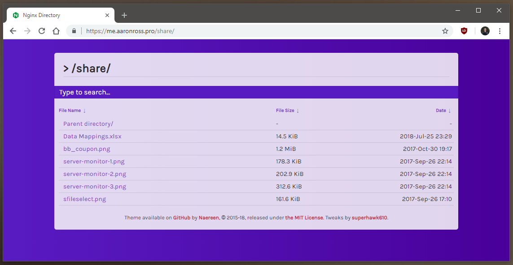
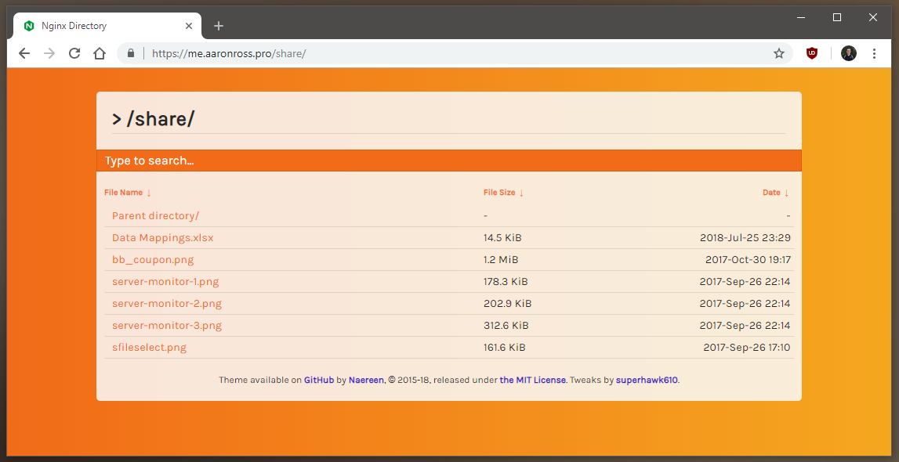
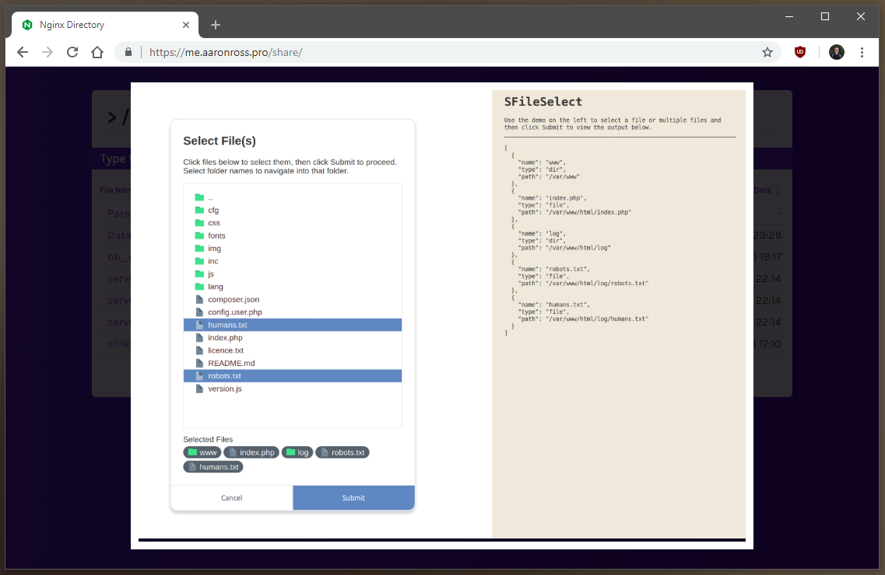

# Nginx-Fancyindex-Theme

A responsive theme for [Nginx](https://www.nginx.org/) Fancyindex module. Minimal, modern and simple.
Comes with a search form, aims to handle thousands of files without any problems.

The fancyindex module can be found [here](https://github.com/aperezdc/ngx-fancyindex) (by @aperezdc).

### This fork adds 2 new themes and some tweaks, including image previews.

[](https://www.nginx.org/)

### [NEW] Cool theme:



### [NEW] Warm theme:



### [NEW] Image previews:



## Usage

1.  Make sure you have the fancyindex module compiled with nginx, either by compiling it yourself or installing nginx via the full distribution (paquet `nginx-extras`).
2.  Clone this repository at the root of your fancyindex directory.
3.  Include the content of [fancyindex.conf](fancyindex.conf) in your location directive (`location / {.....}`) in your nginx config (usually `nginx.conf`).
4.  Restart/reload nginx.
5.  Check that it's working, and enjoy!

## Configuration

A standard config looks something like this (change the `fancyindex_header` path to select a theme):

```bash
fancyindex on;
fancyindex_localtime on;
fancyindex_exact_size off;

fancyindex_header /Nginx-Fancyindex-Theme/cool/header.html;
fancyindex_footer /Nginx-Fancyindex-Theme/footer.html;

fancyindex_ignore examplefile.html; # Ignored files will not show up in the directory listing, but will still be public.
fancyindex_ignore Nginx-Fancyindex-Theme-light; # Making sure folder where files are don't show up in the listing.

# Warning: if you use an old version of ngx-fancyindex, comment the last line if you
# encounter a bug. See https://github.com/Naereen/Nginx-Fancyindex-Theme/issues/10
fancyindex_name_length 255; # Maximum file name length in bytes, change as you like.
```

If you want to conserve a few more bytes in network transmissions enable gzip on the served assets.

```bash
# Enable gzip compression.
gzip on;

# Compression level (1-9).
# 5 is a perfect compromise between size and CPU usage, offering about
# 75% reduction for most ASCII files (almost identical to level 9).
gzip_comp_level    5;

# Don't compress anything that's already small and unlikely to shrink much
# if at all (the default is 20 bytes, which is bad as that usually leads to
# larger files after gzipping).
gzip_min_length    256;

# Compress data even for clients that are connecting to us via proxies,
# identified by the "Via" header (required for CloudFront).
gzip_proxied       any;

# Tell proxies to cache both the gzipped and regular version of a resource
# whenever the client's Accept-Encoding capabilities header varies;
# Avoids the issue where a non-gzip capable client (which is extremely rare
# today) would display gibberish if their proxy gave them the gzipped version.
gzip_vary          on;

# Compress all output labeled with one of the following MIME-types.
gzip_types
  application/atom+xml
  application/javascript
  application/json
  application/ld+json
  application/manifest+json
  application/rss+xml
  application/vnd.geo+json
  application/vnd.ms-fontobject
  application/x-font-ttf
  application/x-web-app-manifest+json
  application/xhtml+xml
  application/xml
  font/opentype
  image/bmp
  image/svg+xml
  image/x-icon
  text/cache-manifest
  text/css
  text/plain
  text/vcard
  text/vnd.rim.location.xloc
  text/vtt
  text/x-component
  text/x-cross-domain-policy;
  # text/html is always compressed by gzip module

  # This should be turned on if you are going to have pre-compressed copies (.gz) of
  # static files available. If not it should be left off as it will cause extra I/O
  # for the check. It is best if you enable this in a location{} block for
  # a specific directory, or on an individual server{} level.
  # gzip_static on;
```

> Reference: [H5BP Nginx Server Config](https://github.com/h5bp/server-configs-nginx/blob/master/nginx.conf)

### Original work by [@Naereen](https://github.com/Naereen)

[MIT Licensed](https://lbesson.mit-license.org/) (file [LICENSE](LICENSE)).
(c) [Lilian Besson](https://GitHub.com/Naereen), 2016-present.
